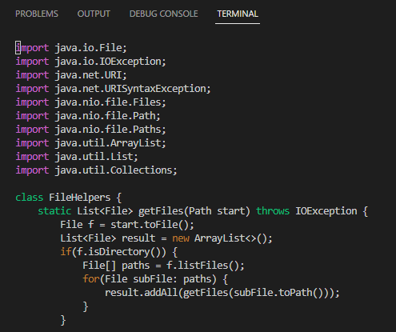
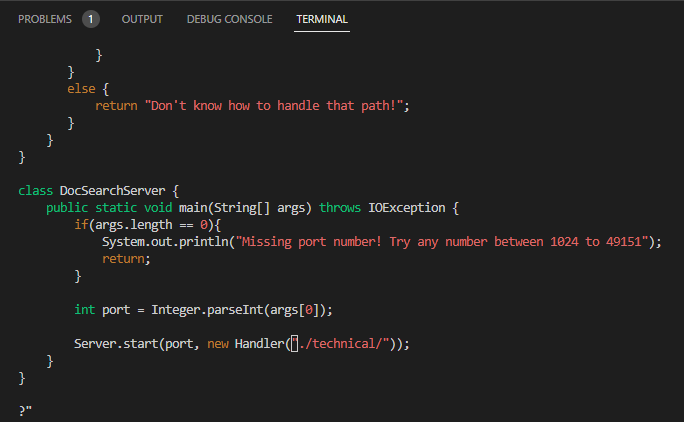
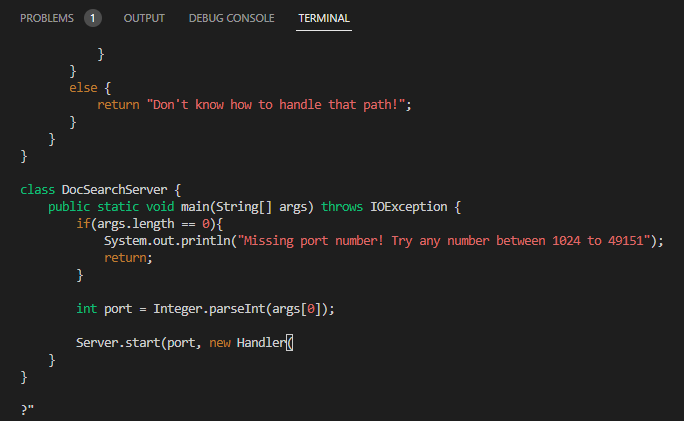
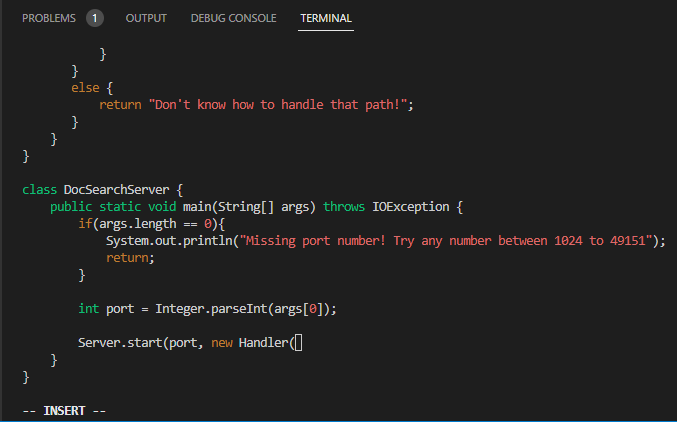
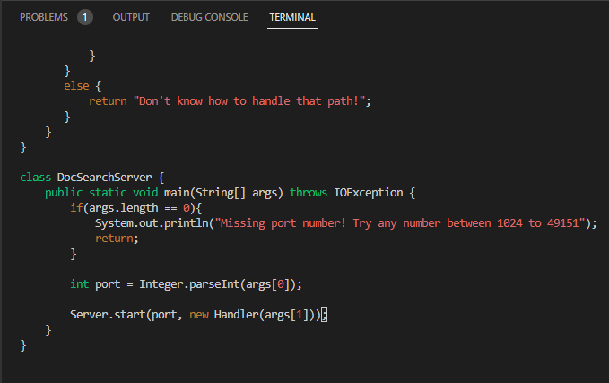

# __Week 7 Lab Report__

## Part 1

 

__Solution for "changing the main method to take a command-line argument"__

`/ technical<enter>N?”<enter>Daargs[1]));<esc>:w<enter>`

 

__Steps:__

After we typed `vim DocSearchServer.java` in the terminal, it jumped into a new page as the screenshot bewlow. (If we haven't opened this file before, the cursor will appear at the beginning of the document. Otherwise, the cursor will appear where it was last located.)

 

`/technical<enter>` searched the file for where the first "technical" appear. Then the cursor jumped to the position of the first character of the "technical" as the screenshot below.

 

`N`(it is capital!) repeated the search of "technical" in opposite direction, which means the cursor jumped to the position of the first character of the last "technical" as the screenshot below.

 

`?"<enter>` searched backward for the first symbol `"`, and the cursor jumped to its position as the screenshot below.

`D`(it is capital!) deleted the content from the current cursor position to the end of this line as the screenshoot below.

`a` moved the cursor back one unit and automatically switched to INSERT mode.

Just typed `args[1])); <esc>` to complete the statement, and exited the INSERT mode to normal mode as the screen shot below.

`:w<enter>` saved the file, but did not exit as the screenshot below.

After completing all the above steps, we have achieved the goal of the task, which is change the main method to use the second command-line argument as the path to search.

 
 
 

## Part 2

 

It took me 44.18 seconds to complete everything in the first style. The problem with this process is that it would have taken me a lot more time if I hadn't prepared the **scp** code in advance.

 

Meanwhile, I spent a total of 36.07 seconds in the second style. Using **Vim** to edit a document on a remote server seems like a faster way, but I spent more time moving the cursor and editing. Obviously, it takes more time for newcomers to become familiar with **Vim**'s various operations.

 

 

**Which of these two styles would you prefer using if you had to work on a program that you were running remotely, and why?**

If I have to work on a program remotely, I would like to choose the first style which is start in Visual Studio Code and make the edit there, then scp the file to the remote server. It is because of there are lots of extension tools in the VS Code, such like auto indent, syntax check and so on. This allows me to edit and review the code more quickly.

 

**What about the project or task might factor into your decision one way or another? (If nothing would affect your decision, say so and why!)**

I think the amount of work I have to do with the code will influence my decision. If the document already exists here and I only need to make some brief edits and changes, I will choose to work in a remote server. Otherwise, I will work on the VS Code, which more familiar to me and has a better user interface. If I need to use some syntax or environment that is not available on my local server, and I do not want to install them, I will choose to work on a remote server. 
