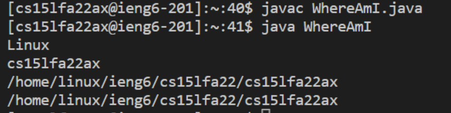
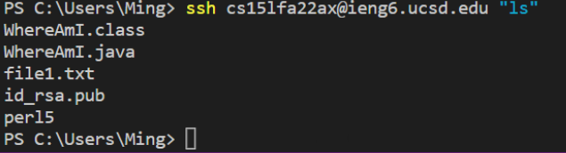

# __Week 1 Lab Report__ 

This is a tutorial for incoming CSE 15L students about how to login to the course-specific account on the remote server ‘ieng6’.

## Part 1 - Installing VScode

Download Visual Studio Code from its official website [Visual Studio Code](https://code.visualstudio.com/). __Notice__: Look at the below picture - there are different versions of different operating systems, do not get the wrong version!

Just follow the instructions for the installing process, then you will get a window that looks like the below screenshot.

## Part 2 - Remotely 

Firstly, check if you have installed the OpenSSH client on your device. If not, please follow the instructions on [Install OpenSSH](https://code.visualstudio.com/docs/remote/ssh#_connect-to-a-remote-host). Notice: We do not need the OpenSSH server right now.

After the OpenSSH client and VS Code are allset, open your VS Code’s terminal. You should see “Terminal” on the top bar, then click on “New Terminal”, as the screenshot below:

Secondly, type ‘<mark>ssh cs15lfa22xx@ieng6.ucsd.edu</mark>’ into your terminal, and you will recieve a  warning message since it’s your first time to login. Please trust your professor then type “yes”. Then you will be asked to type your password, it should be the same as your UCSD SSO password. If you have any trouble logging in, please ask your instructor.
 
You will have your own special code for the __‘xx’__ part, and the password will be hidden. After you successfully login to a remote server, you will see a page the same as below.

## Part 3 - Trying Some Commands

There are lots of useful commands:

In the “9$” line, I typed ‘ls’ to check all the files in the current directory so that we could see a folder named “<mark>perl5</mark>”.

Then, I used ‘cd perl5’ to enter folder, then used ‘pwd’ to show ours current directory that we can see we were in the “<mark>/home/linux/ieng6/cs15lfa22/cs15lfa22ax/perl5</mark>”.

‘<mark>cd ~</mark>’ - Go back to the last folder.

‘<mark>touch file1.txt</mark>’ - Created a txt file named file1.
 

We can use “<mark>Ctrl + D</mark>” or run commit ‘<mark>exit</mark>’ to exit!

## Part 4 - Moving Files with scp

We have a Java file named WhereAmI.java, then we use the below code to transfer it to our remote server. Notice: We should type this code in our local directory.

After the file is transferred to the remote server, let’s login to the server.

We can see that the WhereAmI.java file is transferred to the remote server now.

## Part 5 - Setting an SSH Key

Create a ssh key by type ‘ssh-keygen’, then follow the instruction that we will get a page close to the screenshot:

 
After we copy the public key to the remote server .ssh directory, we do not need to type password to enter the server as the below screenshot.

## Part 6 - Optimizing Remote Running

We can use ‘<mark>javac fileName.java</mark>’ and ‘<mark>java fileName</mark>’ to build and run the java file on the remote server. __Notice__: We can use semicolons(;) to run more than one file at the same time.

We can use <mark>“”</mark> at the end of an .ssh command to just run it without entering the remote server, then it will automatically go back to t/he local directory as the below screenshot. We used ‘<mark>“ls”<mark>’ to check all the files in the remote server.

# Bye~~~