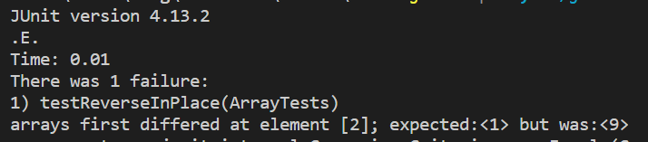
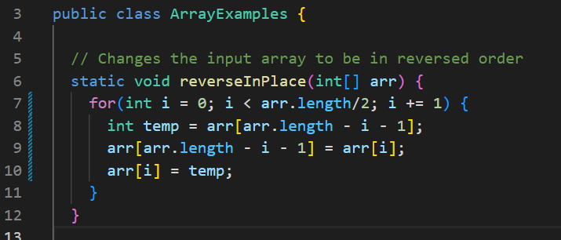
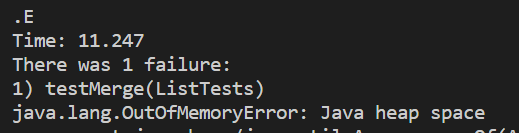
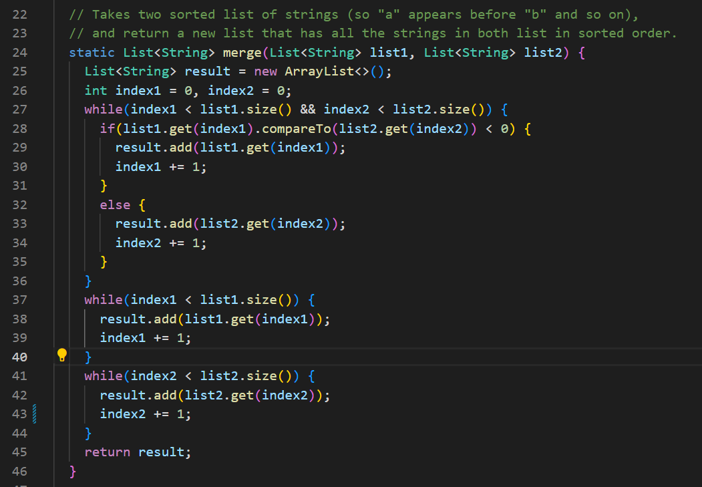

# __Week 3 Lab Report__

## Part 1 - Search Engine
### Code for Search Engine:

```  
import java.io.IOException;
import java.net.URI;
import java.util.ArrayList;

class Handler implements URLHandler {
    // The one bit of state on the server: a number that will be manipulated by
    // various requests.
    ArrayList<String> str = new ArrayList<String>();
        
    int size = 0;
    public String handleRequest(URI url) {
        if (url.getPath().equals("/")) {
            return String.format("Array List: " + str);
        } else if (url.getPath().contains("/add")) {
            String[] parameters = url.getQuery().split("=");
            if (parameters[0].equals("s")) {  
                str.add(parameters[1]);
                return String.format("Array List added by \"" + parameters[1] + "\". It's now "+ str);
            }
            return "404 Not Found!";
        } else {
            System.out.println("Path: " + url.getPath());
            if (url.getPath().contains("/search")) {
                String[] parameters = url.getQuery().split("=");
                if (parameters[0].equals("s")) {
                    ArrayList<String> result = new ArrayList<String>();
                    for(int i = 0; i < str.size(); i++){
                        if(str.get(i).indexOf(parameters[1]) != -1){
                            result.add(str.get(i));
                        }
                    }
                    return String.format("The search result of \"" + parameters[1] + "\" is/are: " + result);
                }
            }
            return "404 Not Found!";
        }
    }
}

public class SearchEngine {
    public static void main(String[] args) throws IOException {
        if(args.length == 0){
            System.out.println("Missing port number! Try any number between 1024 to 49151");
            return;
        }

        int port = Integer.parseInt(args[0]);

        Server.start(port, new Handler());
    }
} 
```


### Testcase Output:

This is the original page for the Search Engine web server that shows an empty array list. It called the handleRequest() method, based on the parameter URI url to print our the array list.


This screenshot shows the Search Engine web server page after we add an “add” query behind the original url “localhost:4000”. Here add an element “apple” into the array list. 
It called the handleRequest() method, and get the value after the symbol "=" based on the parameter URI url, then added it into the array lsit. 


The below screenshot shows the Search Engine web server page after we add another “add” query behind the original url “localhost:4000”. A new element “pineapple” be added into the array list. 
It called the handleRequest() method, and get the value after the symbol "=" based on the parameter URI url, then added it into the array lsit.


This screenshot shows the Search Engine web server page after we add another “add” query behind the original url “localhost:4000”. The same array list becomes [apple, pineapple, bana].
It called the handleRequest() method, and get the value after the symbol "=" based on the parameter URI url, then added it into the array lsit.


This screenshot shows the web server page after we add another “search” query behind the original url “localhost:4000”. This query will check if the searched argument (after “search?=”) is the subString of every element in the array list (the array list has been added “apple”, “pineapple” and “banana” respectively). As the result, there returns and shows a new array list that includes every element which contains the searched argument “app”. 
It called the handleRequest() method, and get the value after the symbol "=" based on the parameter URI url, then searched if any element in the array list contains the searched.


This screenshot shows the “search” query that does not find any element containing the searched argument “yyy” from the array list, and returns an empty result. 
It called the handleRequest() method, and get the value after the symbol "=" based on the parameter URI url, then searched if any element in the array list contains the searched.


In conclusion, 


## Part 2 - Bugs

### The reverseInPlace() method from the ArrayExamples.java:

The failure-inducing input: {1,5,9}.

Except: {9,5,1}.

Symptoms:




Bug: The changes happened in the original array. The first element will be lost. There needs to initialized a new int variable `temp` to store the value of `arr[arr.length - i - 1]`, then let `arr[arr.length - i - 1] = arr[i]` and `arr[i] = temp`. And, change the for loop range to `i < arr.length/2` as the screenshot in the below part.

Fixed Code:




### The merge() method from the ListExamples.java:
The failure-inducing input: L1 = {“a”, “b”, “y”}, L2 = {“c”, “d”, “z”}.

Except: {“a”, “b”,“c”, “d”,  “y”,  “z”}.

Symptoms:



Bug: In line 43, the code is `index1 += 1`, but for this loop, it is supposed to traverse List 2, so the loop can not be ended when it does not have the increment variable `index2`. So, we just need to change the `index1 +=1` to `index2 +=1`.

Fixed Code:




