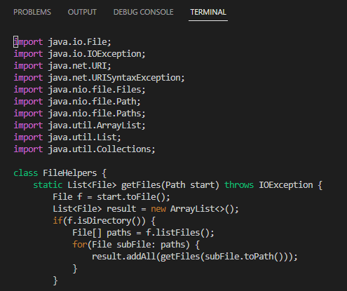
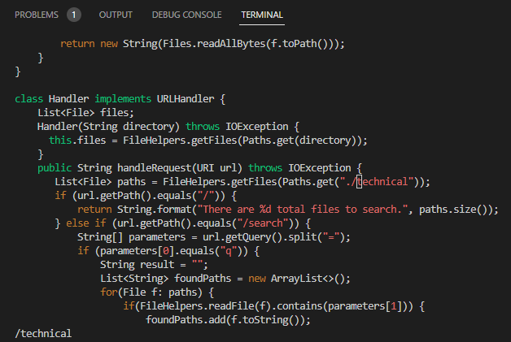
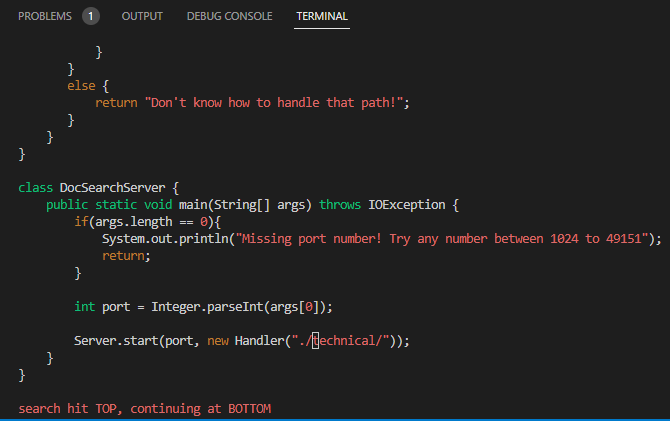
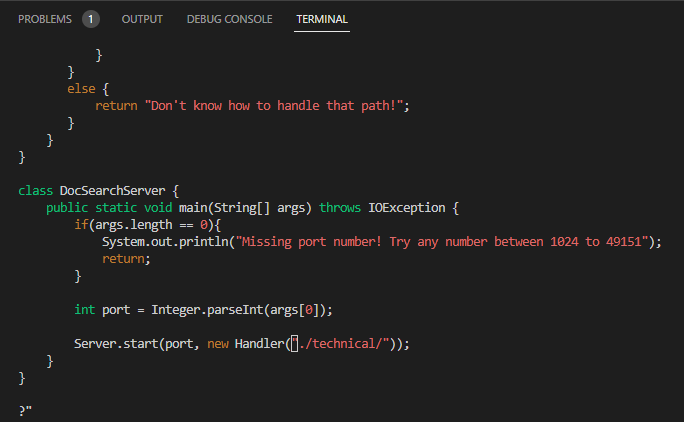
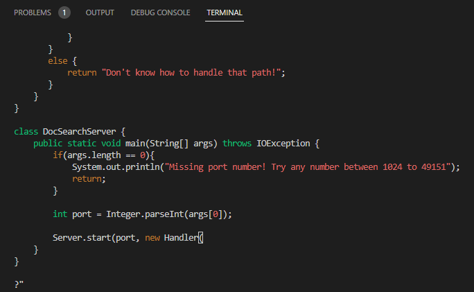
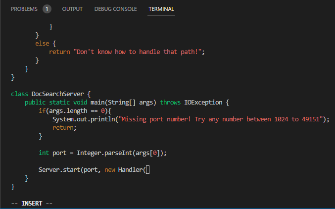
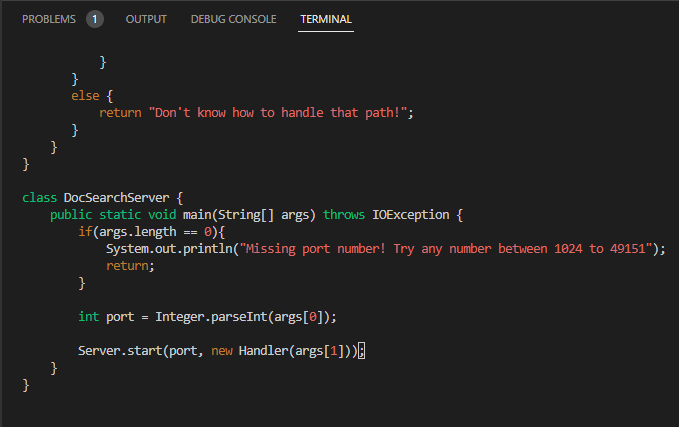
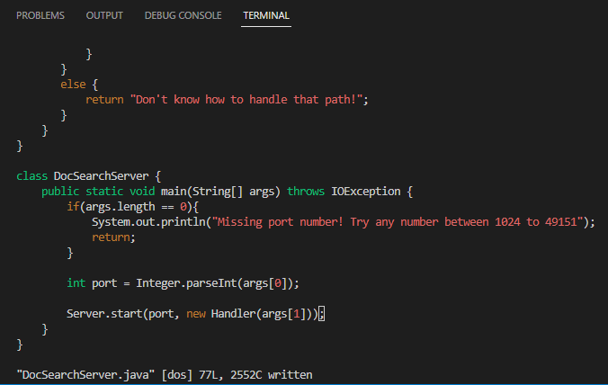

# __Week 7 Lab Report__

## Part 1

 

__Solution for "changing the main method to take a command-line argument"__

`/ technical<enter>N?”<enter>Daargs[1]));<esc>:w<enter>`

 

__Steps:__

After we typed `vim DocSearchServer.java` in the terminal, it jumped into a new page as the screenshot bewlow. (If we haven't opened this file before, the cursor will appear at the beginning of the document. Otherwise, the cursor will appear where it was last located.) 

 

`/technical<enter>` searched the file for where the first "technical" appear. Then the cursor jumped to the position of the first character of the "technical" as the screenshot below.

 

`N`(it is capital!) repeated the search of "technical" in opposite direction, which means the cursor jumped to the position of the first character of the last "technical" as the screenshot below.

 

`?"<enter>` searched backward for the first symbol `"`, and the cursor jumped to its position as the screenshot below.

`D`(it is capital!) deleted the content from the current cursor position to the end of this line as the screenshoot below. 

`a` moved the cursor back one unit and automatically switched to INSERT mode.

Just typed `args[1])); <esc>` to complete the statement, and exited the INSERT mode to normal mode as the screen shot below.

`:w<enter>` saved the file, but did not exit as the screenshot below.

After completing all the above steps, we have achieved the goal of the task, which is change the main method to use the second command-line argument as the path to search.
 
 
 

## Part 2

 

