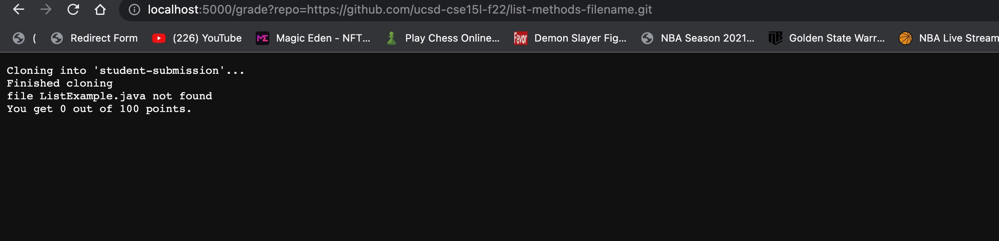
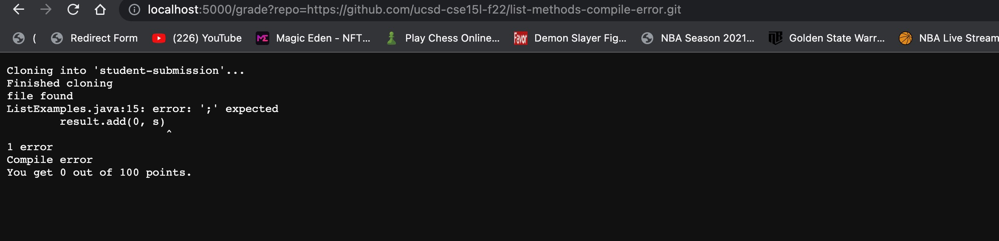
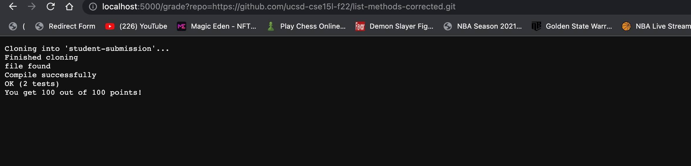

# __Week 9 Lab Report__

## Code for `grade.sh`

<br>

```
rm -rf student-submission

git clone $1 student-submission

echo 'Finished cloning'

cp TestListExamples.java student-submission/
cp -r lib student-submission/

cd student-submission

if [[ -e ListExamples.java ]]
then 
    echo "file found"
else 
    echo "file ListExample.java not found"
    exit 1
fi 

javac -cp .:lib/hamcrest-core-1.3.jar:lib/junit-4.13.2.jar *.java &> compile.txt 

if [ $? -eq 0 ]
then 
    echo "Compile successfully"
    java -cp .:lib/hamcrest-core-1.3.jar:lib/junit-4.13.2.jar org.junit.runner.JUnitCore TestListExamples &> result.txt

    if grep "OK" result.txt
    then 
        echo "You get 100 out of 100 points!"
    fi

    if grep -i "FAILURES" result.txt
        if grep -i "FAILURES: 1" result.txt
        then 
            echo "You get 50 out of 100 point."
        else
            echo "You get 0 out of 100 points."
    fi

else
    cat compile.txt
    echo "Compile error"
    echo "Failed"
    exit 1
fi
```
<br>

<br>

## Screenshots for three student submission

Student submission 1: https://github.com/ucsd-cse15l-f22/list-methods-filename.git.




Student submission 2: https://github.com/ucsd-cse15l-f22/list-methods-compile-error.git. 



Student submission 3: https://github.com/ucsd-cse15l-f22/list-methods-corrected.git. 



## Trace analysis for the third student submission:

This student submission is correct, so that it got the 100/100.

`rm -rf student-submission` : 
   
This line forcibly deleted all files in the student submission directory without prompting.

Stdout: none

Stderr: none

Return code: 0

<br>


`git clone $1 student-submission` : 

This line cloned the repository to the folder of student submission.

Stdout: none

Stderr: none

Return code: 0

<br>


`echo 'Finished cloning'` :

This line outputed "Finished cloning", means it finished the cloning.

Stdout: "Finished cloning"

Stderr: none

Return code: 0

<br>


`cp TestListExamples.java student-submission/` :

This line copied TestListExamples.java into the folder of student-submission.

Stdout: none

Stderr: none

Return code: 0

<br>


`cp -r lib student-submission/` :

This line copied every files and folders in the folder of lib into the folder of student-submission.

Stdout: none

Stderr: none

Return code: 0

<br>


`cd student-submission` :

This line entered the folder of student-submission.

Stdout: none

Stderr: none

Return code: 0

<br>


` if [[ -e ListExamples.java ]] ` :

This if statement was true since there exist a file named ListExamples.java.

<br>


` echo "file found"` :

Stdout: "file found"

Stderr: none

Return code: 0

<br>


`echo "file ListExample.java not found"` :

Does not run.

<br>


`exit 1` :

Does not run.

<br>


`javac -cp .:lib/hamcrest-core-1.3.jar:lib/junit-4.13.2.jar *.java &> compile.txt` :

This line compiled and tested every java files in the folder of student-submission.

Stdout: All contexts stored into in the compile.txt.

Stderr: none

Return code: 0

<br>


`if [ $? -eq 0 ]` :

This if statement was true since the code returned in the previous statement is 0.

<br>


`echo "Compile successfully"` :

Stdout: "Compile successfully"

Stderr: none

Return code: 0

<br>


`java -cp .:lib/hamcrest-core-1.3.jar:lib/junit-4.13.2.jar org.junit.runner.JUnitCore TestListExamples &> result.txt` :

This line ran the testing script.

Stdout: All contexts stored into the result.txt.

Stderr: none

Return code: 0

<br>


`if grep "OK" result.txt`:

This if statement was true since the result.txt contains "OK".

<br>


`echo "You get 100 out of 100 points!"` :

Stdout: "You get 100 out of 100 points!"

Stderr: none

Return code: 0

<br>


`if grep -i "FAILURES" result.txt ` :

This if statement was false since the result.txt doest not contain "FAILURES".

<br>


` if grep -i "FAILURES: 1" result.txt` 

Does not run.

<br>


`echo "You get 50 out of 100 point."` ：

Does not run.

<br>


`echo "You get 0 out of 100 points."` :

Does not run.

<br>


`cat compile.txt` :

Does not run.

<br>


`echo "Compile error"` :

Does not run.

<br>

   
`echo "Failed"` :

Does not run.

<br>

   
`exit 1` ：

Does not run.


